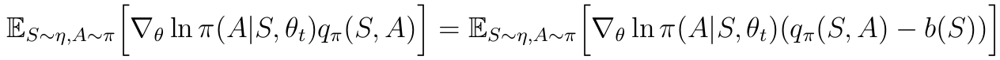
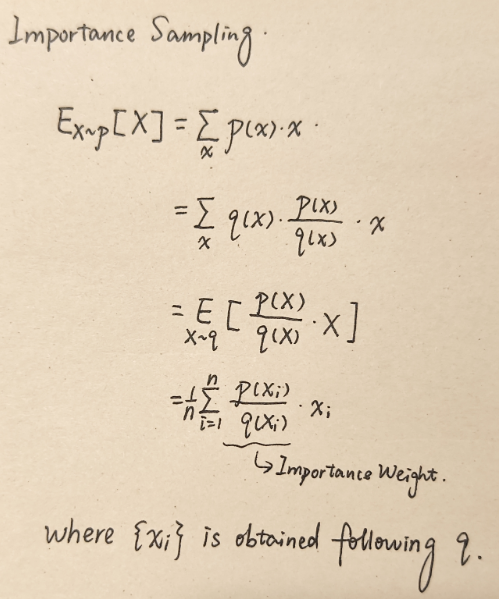

#### Chapter 10 Actor-Critic Method

Q actor-critic, Advantage actor-critic(A2C) / TD actor-critic, Off-policy actor-critic, Deterministic actor-critic

1. Explain the meaning of actor and critic.

**Q actor-critic**

2. What is the relationship between REINFORCE and QAC?
3. Explain the process of QAC.

**Advantage actor-critic(A2C) / TD actor-critic**

4. What is the idea of Advantage?
5. How to reduce the estimation variance?
6. Why and How to estimate qt and vt? Use 2 methods and explain the difference.
7. Explain the process of A2C.

**Off-policy actor-critic**

8. What is importance sampling?
9. Explain the process of off-policy actor-critic.

**Deterministic actor-critic**

10. What is the difference between μ and π?
11. The expression of the gradient of J(θ) in the deterministic situation.
12. The process of deterministic actor-critic.

1. Actor refers to the policy update step because actions are taken following the policy. Critic refers to the value update step because it criticizes the actor by evaluating the value.
2. Both of them are basically policy gradient methods and use gradient-ascent method to do policy update step. However, the way of value update is difference. If used MC method to do value update, then it is REINFORCE. If used TD method (Sarsa) to do value update, then it is QAC.

3. QAC is the simplist actor-critic method.

4. We add an additional baseline to the gradient of metric in policy gradient method to reduce the estimation variance. The lower it is, the more accurate it is to use samples to approximate the gradient.
5. When adding a baseline b(S) to the gradient, it remains unchanged.

​	The proof is as follows:

​	Although E[∇J(θ)] is invariant to the baseline, the estimation variance is not. In REINFORCE and QAC, the baseline is 0 and it is not a good baseline to reduce the estimation variance. The optimal baseline to reduce *var*(∇J(θ)) is:

which is too complex to be useful. Thus we remove the weight and get a suboptimal baseline:

which coincidentally, is the state value.

​	Then when b(S) = vπ, the gradient-ascent method becomes:

where δπ(S, A) is the advantage function. The we use samples to approximate:

where δt(st, at) reflects the advantage of at over others. The greater it is, the better the action is. This is also one of the differences between A2C and policy gradient in Chapter 9. We replace qt(st, at) with δt(st, at). 

6. If we use MC method to estimate qt(st, at) and vt(st), then it is called REINFORCE with a baseline. If we use TD method to estimate, then it is called A2C, which is also called TD actor-critic:

​	The reason why we do the estimate is that we only need one neural network to represent vπ(s) after doing the estimate. Otherwise, we need two neural networks to represent both qπ(s, a) and vπ(s).

7. 

8. Importance sampling can use sufficient samples following distribution q to approximate the expectation following distribution p when p is not easy to obtain enough samples and the expression of p is not available. The derivation is:

​	In off-policy actor-critic, we use samples of behavior policy to approximate the derivation expectation.

9. All the previous policy gradient methods (REINFORCE, QAC, Q2C) are on-policy. Using inportance sampling can help we utilize the samples generated by another policy β, the behavior policy. The expectation of the metric gradient can be written as:

​	Then the gradient-ascent algorithm can be written as:

10.  μ is the deterministic policy, which indicates that at any state, one action is given a probablity of 1 and other actions are given 0. We denote a = μ(s) because μ directly gives an action at a state instead of a probablity space.

11. 

12. 

