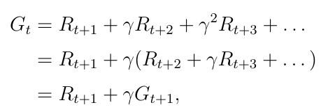

#### Chapter 2  State Value and Bellman Equation

State Value, Bellman Equation, Action Value

1. Why did we introduce State Value? Isn't return enough to valuate a policy?
2. Explain the understanding of Random Variables in RL.
3. Explain how state values depend on each other(Bootstrapping)?
4. What is Gt? What is the difference between Gt and vt?
5. What does Bellman Equation tell us?
6. What is policy evaluation?
7. Derive the Bellman Equation. How to understand the ultimate format of Bellman Equation?
8. Did find any principle when dealing with multiple Σ ?
9. In the Bellman Equation, what are unknown, what represent the model, is π given?
10. Derive matrix-vector form of Bellman Equation.
11. Why need matrix-vector form beyond elementwise form?
12. How to solve Bellman Equation? Give 2.
13. Prove that the iterative solution is converged.
14. What is action value? Is action value based on state or has no relationship with state?
15. What is the relationship between state value and action value?
16. The elementwise form of action value.
17. Derive the matrix-vector form of action value.
18. In the matrix-vector form of state value and action value, we have vector *v* = [v1, v2, v3, ..., vn]-1and *q* = [q1, q2, q3, ..., qn]-1. Explain what do these 2 sequences represent for? Does sequence *v* represent for the state values of the whole state space? Does sequence *q* represent for the action values of the action space of a state?

1. In stochastic system, the model (state transition and reward) is stochastic and can be described using conditional probabilities. Return can only describe a deterministic trajectory, but state value can described the expected return of a stochastic trajectory.

2. Random Variables do not have a deterministic value, but have a row of values with coresponded probabilities(Probability Distribution). Such as action, state transition, return, they are stochastic and are described with probability distribution.

3. vt = rt+1 + γ · rt+2 +  γ2 · rt+3 + ··· = rt+1 + γ · vt+1

4. Gt is a stochastic variable describes the discounted return of state st following a policy. vt is the expectation of Gt and it is a deterministic value.

   

5. Bellman Equation solve state values based on the model and a given policy. It explains the relationship between vπ(s) and vπ(s') based on the model. Also, Bellman Equation is fundamentally a formula calculating the AVERAGE DISCOUNTED RETURN on state s, it shows the general situation.

6. The process of solving Bellman Equantion to get state values is policy evaluation. 

7. 

​	

​	

8. We can freely arrange the items and Σ. Just make sure that when the item and the Σ have the same variable notation, the items should follow behind the Σ but not before.

9. vπ(s) and vπ(s') is unknown, p(r|s,a) and p(s'|s,a) represent the model, π is a given policy and the process is policy evaluation because state values can evaluate the perfermance of the policy.

10. 

11. Bellman Equation is a row of formula of every state. To solve it, we must put it together. Matrix-vector form can deal with this.
12. Closed-form solution and iterative solultion.

13. 

14. Action value is the discounted return of taking a specific action at a specific state. Same action on different state may have different action value.

15. State value is the expectation value of every action value on this state.

16. 

17. **Derive by myself. No record in the book. So maybe some mistakes.**

18. They don't represent for the state values of the whole state space or the action values of the action space of a state. They come from bootstrapping. They are sequential records of the state values and action values obtained during a trajectory following the policy.