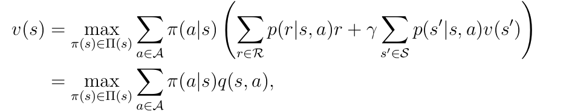
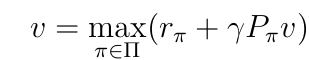

#### Chapter 3 Bellman Optimality Equation

Optimal Policy, Bellman Optimality Equation(BOE)

1. What IS policy foundamentally? Is it a path?
2. The definition of optimal policy? Why need EVERY state to be the maximum?
3. The definition of BOE, both elementwise form and matrix-vector form.
4. How state values and optimality policy is influenced if r went through a linear transformation?
5. Do we need to set a negetive value to r when the agent step into a normal area to encourage avoid detour?
6. Do BOE always have a optimal policy solution? Is the solution unique? Is the solution stochastic or deterministic?

1. Policy is the probablity distribution of next state on EVERY state. Don't draw a path and say this is a policy, should also consider states that are not included in that path.

2. Arbitrary state in the state space has the maximum state value than any other policies. This can ensure that the agent can get max return starting from arbitrary state.

3.  

   

   

4. If every r is changed by a linear transformation to ar + b, then v will be changed to av + b/(1-γ). If the current policy is the optimal, then it is still the optimal policy.

5. No. Setting them to negative is meaningless because this is a linear transformation. The agent will go detour or not doesn't depend on whether is negative or not, but depends on γ. Because the more earlier it reaches the target, the pow of γ is less, and the decay of the reward is less.

6. BOE always have a optimal policy solution, and it can be non-unique. The optimal policy can be either stochastic or deterministic, but there is always a deterministic one.