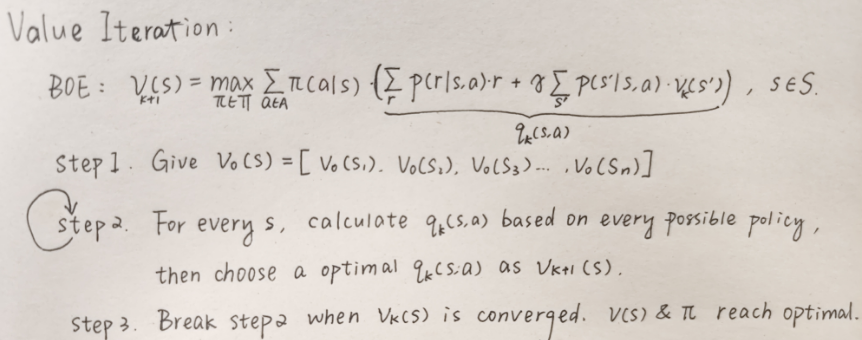

#### Chapter 4 Value Iteration and Policy Iteration

Value Iteration, Policy Iteration, policy update, value update, Truncated Policy Iteration

**Value Iteration:**

1. Explain the process of value iteration.
2. In every iteration, when calculating based on every possible policy, can this be infinite because there are infinite policies?
3. What is policy update and value update?
4. In every iteration, is v(s) satisfy Bellman Equation?
5. What is Q-Table?

**Policy Iteration:**

6. Explain the process of policy iteration.
7. What is the fundamental difference between policy iteration and value iteration?
8. In every iteration, is v(s) satisfy Bellman Equation?

**Truncated Policy Iteration:**

9. Explain the process of truncated policy iteration.

10. Explain the difference and common between truncated policy iteration, policy iteration, and value iteration. What are their advantages?

11. Any tip to make policy evaluation more efficient?

1. 

2. No. From BOE, we can understand that only in this condition can BOE reach its optimal:

​	

​	Thus, the policy space is finite. It is equal to, in every state, we just need calculate every action's action 	value and choose the largest one.

3. Policy update is when π is assigned a new value. Value update is when *v* is assigned a new value.

4. No. Cannot ensure it satisfies the Bellman Equation. It is only an intermediate value mathematically generated by the algorithm. When it is converged, v(s) then satisfies the Bellman Equation.

5. 

​	

6. 

​	

7. Policy iteration used infinite iters to calculate vk, but value iteration only use 1 iter to get a new vk.

8. Yes. Because these v(s) is the precise solution of the Bellman Equation. However, in truncated policy iteration, v(s) is not the solution of Bellman Equation.

9.  

   

10. Value iteration use 1 iter to estimate v(s), policy iteration use infinite iters to estimate a precise v(s), truncated policy iteration use finite iters to estimate v(s). VI has the least calculation but the slowest to converge. Policy iteration has the most calculation but the fast to converge. 

    A common property of the three algorithms is that every iteration has two steps. One step is to update the value, and the other step is to update the policy. The idea of interaction between value and policy updates widely exists in reinforcement learning algorithms. This idea is also called generalized policy iteration

11. In policy iteration, choose vπk-1 as the initial value v vπ0 in this iter. However, in truncated policy iteration, we cannot get the precise vπk-1, but it can still make the process more efficient.

