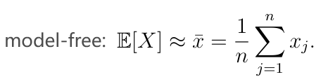
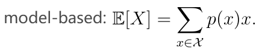
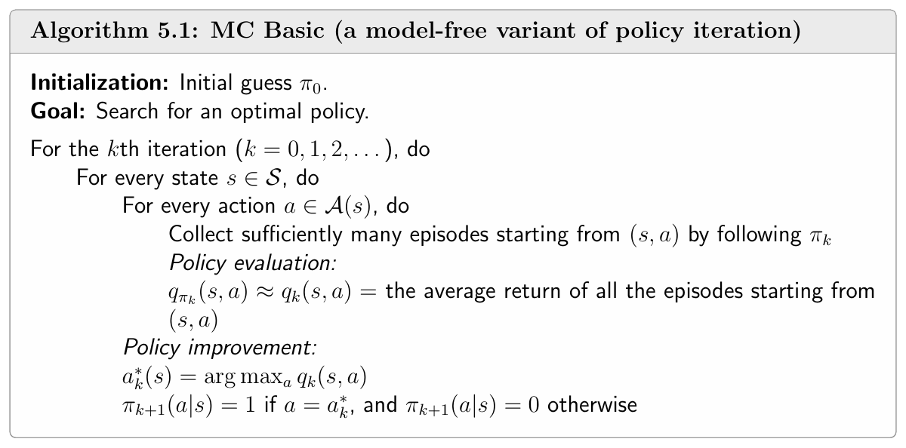
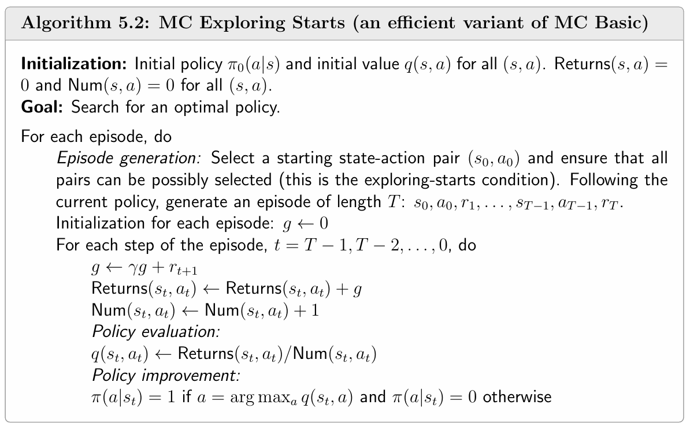
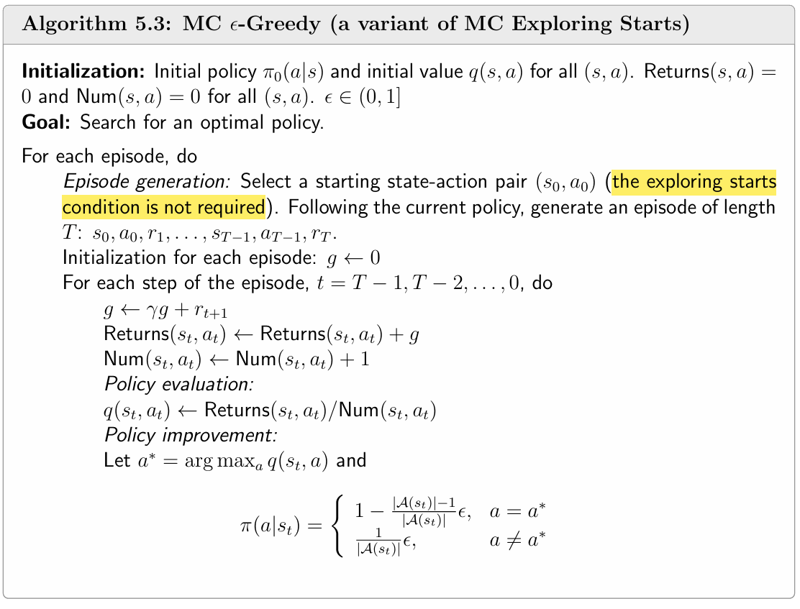

#### Chapter 5 Monte Carlo Methods

Model-free, MC Basic, MC Exporing Starts, MC ε-Greedy

**Model-free:**

1. What is the relationship between this chapter and chapter 4?
2. What is the difference between model-based and model-free?
3. Give an example to explain the principle of Monte Carlo.
4. What is the condition to use model-free methods?

**MC Basic: (inefficient)**

5. How MC Basic based on policy iteration? Explain the process of MC Basic.
6. If episodeds are finite, will the algorithm work?

**MC Exploring Starts:** 

7. What is the main improvement of MCES compared with MC Basic? What is initial-visit, first-visit and every-visit?

8. Explain the process of MCES.
9. What is the condition of MCES?

**MC ε-Greedy:**

10. Explain the main improvement of MC ε-Greedy compared with MCB and MCES.
11. What is a soft policy? What is greedy policy and what is ε-greedy policy?
12. Explain the process of MC ε-greedy.
13. How to implement the ε-greedy policy when selecting an action?
14. Can MC ε-greedy obtain the optimal policy? How to solve this problem?
15. Is it possible to use MC ε-Greedy based on only 1 episode but enough long?

1. Monte Carlo Methods is based on policy iteration. In addition, methods in chapter 4 must be based on models(Dynamic Programming). From this chapter, methods are model-free.

2. Model-free is based on data, which the agent gained from the interaction experience with the environment. 

3. The principle of model-free is learning from data, for example, Monte Carlo methods use mean estimation of samples to approximate the mathematical expectation of a random variable. However, not all model-free methods use mean estimation.

   

   State value and action value are all random variables. Thus in MC methods, we use this approach to estimate state value and action value.

   But model-based methods use the distribution of the probability distribution to precisely calculate the mathematical expectation of a random variable.

   

4. The samples must satisfy i.i.d (independent and identically distributed). Independent means the collection of one sample doesn't influence other samples' collection. Identically distributed means all the samples are collected following the same distribution.

5. In policy iteration, we choose the best actions to update the policy based on the optimal action value in each state. When calculating action value, it is based on the system model of p(r|s,a) and p(s'|s,a). However, in MC Basic, action values of each action in each state are gained from the average return of several episodes starting from this state and action. This is the policy evaluation step.

   

6. Still works. Finite episodes means inaccurate approximation of action value. Similarly, the truncated policy interation is also inaccurate when calculating state value which results in inaccurate action value as well.

7. In MCB, each episode is used for estimating the action value of its starting (s,a) pair only (initial-visit strategy). In MCES, each episode can estimate the action values of its every (s,a) pair. Thus the algorithm needs less episodes and can wait less time for agent to generate episodes. 

   If we estimate the action value only the first time visiting the (s,a) pair, it can avoid repeatedly visiting the same (s,a) many time (first-visit strategy). If we estimate the action value every time visiting the (s,a) pair, it can quickly converge (every-visit strategy). 

8. 

9. Every (s,a) pair should have the same probability to be chosen as the start of the episodes, with the aim of making sure every (s,a) pair is well explored to find the best policy.

10. MCεG doesn't need to ensure all (s,a) pairs are well visited. In MCES, it means no need to generate episodes starting from every (s,a) pair with the same probablity.
11. Soft policy has the probablity to take any action in a state. Greedy policy has only one determined action to take in a state. ε-greedy policy has a higher chance to take the greedy action but still has probablity to take other actions.
12. 

13. Select a value x from [0,1] following the uniform distribution. If x >= ε, then choose the greedy action. If x < ε, then randomly choose an action (including greedy action and non-greedy actions). This can guarantee that it satisfy the ε-greedy policy.
14. The ultimate policy is the optimal policy in the scope of πε but not π. And the optimal policy should be a deterministic policy rather than a stochastic policy. To solve this problem, we can set a large ε at first to encourage the agent to explore. Then we gradually decrease ε and when ε is small enough, the policy tends to be deterministic.
15. Yes. MC ε-Greedy can ensure to explore every (s,a) if the episode is long enough.