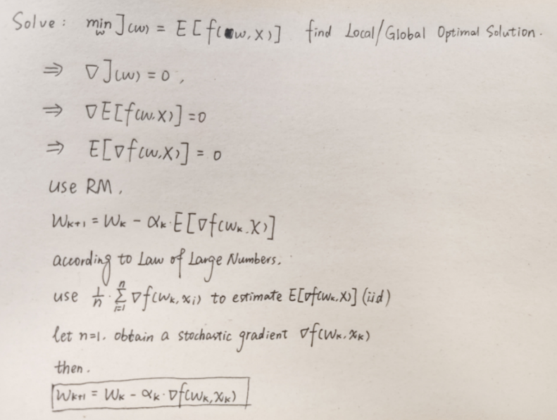
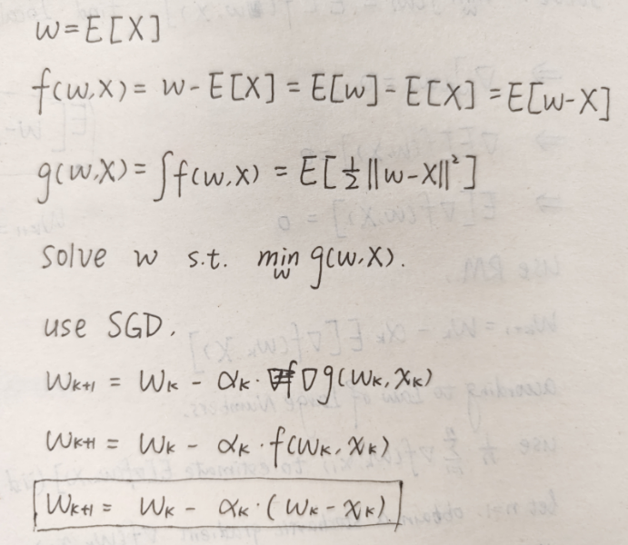

#### Chapter 6 Stochastic Approximation

Stochastic Approximation, Robbins-Monro Algorithm, Stochastic Gradient Descent

**Stochastic Approximation**

1. What is Stochastic Approximation?

**Robbins-Monro Algorithm**

2. Explain the idea and formula of Robbins-Monro algorithm.

3. Explain the convergence conditions of RM and their meanings.

4. How to use RM for mean estimation?

**Stochastic Gradient Descent**

5. Explain the derivation of SGD.

6. How to use SGD for mean estimation?

7. What is BGD and MBGD?

8. What is the convergence conditions and their meanings of SGD?
9. Explain the converge pattern of SGD.

1. Stochastic approximation is a broad class of stochastic iterative algorithms for root-finding or optimization problems. This is not a reinforcement learning algorithm, but is the basic for temporal-difference learning algorithms.

2. Robbins-Monro algorithm is an incremental method used for solving root-finding problems like g(w) = 0. It doesn't need the expression or derivative of the function. We just need noisy outputs g˜(wk,ηk), where η is the noise (error term). 

   

   where ak > 0.

3. 

​			

​	(a) makes sure g(w) is monotonically increasing and can avoid g(w) is too large which will lead to the 	divergence of the algorithm.

​	(b) makes sure that the learning rate is decreasing but should not be that fast.

​	(c) makes sure that the existed error terms {η}'s expectation is always around 0, and every ηk should 	not be so far away from 0.

4. To solve w = E[x], we define g(w) = w - E[x], then the prob is converted to solve g(w) = 0.

​	where (wk - xk) is g˜(wk,ηk), which is:

​									

5. SGD is used for solving optimization problem.

6. 

7. If X has n values, 1 < m < n, then

8. 

​	(a) makes sure that f(w,X) is convex function and ∇f(w,X) is not that large to avoid gradient explosion.

​	(b) makes sure that the learning rate is decreasing but should not be that fast.

​	(c) is a general condition.

9. If the estimate wk is far from the solution w*, then it converges fast. By contrast, it behaves more randomly and slow when they are close.