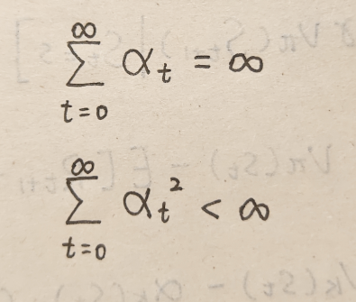
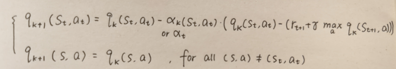

#### Chapter 7 Temporal-Difference Methods

TD Learning for State Values, Sarsa, n-step Sarsa, Q-learning, Online/Offline, On-Policy/Off-Policy

1. What is the relationship between TD Learning for State Values, Sarsa, n-step Sarsa, Q-learning?

**TD Learning for State Values** **&** **Sarsa**

2. Derive the formula of TD for state values.

3. Why is vk\* the TD target?
4. The formula of Sarsa.
5. Explain the process of using Sarsa and ε-greedy to find optimal policy.
6. What is Expected Sarsa?
7. Explain the converge condition of TD for state values, Sarsa and Q-learning.
8. Compare TD with MC.

**n-step Sarsa**

9. What is the relationship between MC, Sarsa and n-step Sarsa?

10. What happens when n increases?

**Q-learning**

11. The expression of Q-learning
12. The porcess of Q-learning(on-policy and off-policy). Why the policy update methods are difference?

**Online/Offline & On-Policy/Off-Policy**

13. What is online/offline?

14. What is on-policy/off-policy?

15. What is the relationship between online/offline and on-policy/off-policy?

16. Explain the unified viewpoint of MC, Sarsa, n-step Sarsa, Q-learning.

1. TD for state values can only estimate state values used for policy evaluation, but can not find an optimal policy. Sarsa can estimate action values and can be combined with policy improvement steps to find optimal policy. n-step Sarsa is the generalization of Sarsa and MC. Q-learning directly solve BOE to obtain optimal policy.

2. Generate expeirence examples (s0, r1, s1, r2,..., st, rt+1, st+1, ...) following given policy π. Initially guess     v0(s) for every state. To estimate state values: 

​	where vk+1 is new estimate, vk is current estimate, (rt+1 + γvk(st+1)) is TD target *vk\**,                                            	(vk(st) - (rt+1 + γvk(st+1))) is TD error *δk*.

3. 

4.  Based on the derivation of TD for State Values, Sarsa only needs few changes.

   

   Here, st+1 and rt+1 is generated by interacting with the environment. at+1 is generated by current policy.

5. 

​	Not all states can gain a optimal policy. TD only focus on finding a optimal path to reach the target state. However, if the expeirence data is enough sufficient, it can still gain optimal policy for every state.

6. Expected sarsa replaces qk(st+1, at+1) with E[qk(st+1, A)] = Σaπt(a|st+1)qk(st+1,a) = vt(st+1). It can reduce the estimate variance of sarsa for deleting the random variable at+1.
7. The learning rate should decrease but cannot decrease very fast.

​	In the practice of **on-policy** methods, we often set learning rate a small constant because the policy is keep changing and a decaying learning rate may be too small to effectively evaluate the policy. Even a constant learning rate may result in fluctuation, if the constant is small enough, then the flucuation can be neglectable.

8. 

​	(1) TD is incremental. It can update state value/action value immediately after receiving an experience example. MC is non-incremental. It must wait until the whole episode is collected because MC need to calculate the discounted rate of the episode.

​	(2) TD can solve continuing tasks because it is incremental. MC can only solve finite episodes or infinite episode but terminate after finite steps.

​	(3) TD bootstraps. It estimates state values/action values relying on previous estimate. Thus TD need an initial guess. MC is not bootstrapping because it directly calculate state values/action values without initial guess.

​	(4) TD has a lower estimation variance than MC because it needs fewer random variables. Take calculating action value qπ(st, at) as an example, Sarsa only needs Rt+1, St+1, At+1 but MC needs                       Rt+1, Rt+2, Rt+3, ... .

9. The difference is how to calculate qπ(st, at). MC and Sarsa are two extreme situation of n-step Sarsa.

10. First, each time updating action value needs a longer time to wait for collecting data (rt+1, rt+2, rt+3, ...., rt+n, st+n, at+n). Second, the variance increases but bias decreases.

11. 

12. 

​	For on-policy method, the policy is used in both exporation and update. Thus we need ε-greedy policy for exploring. For off-policy method, πT only focus on update without exploring. Thus we just need greedy policy.

13. Online is updating values and policy with interacting with the environment. Offline is learning from generated experience samples following a given policy.

14. The policy which we generate experience samples from is called behavior policy πb. The policy which we aim to update to find the optimal policy is called target policy πT. For on-policy methods, these two policies are the same. For off-policy methods, these two policies are different. 

​	Sarsa and MC are on-policy, Q-learning can either be on-policy or off-policy.

​	The reason why Q-learning can be off-policy is that it directly solve BOE. Thus the update of q value is 	not related to the policy.

15. If a method is off-policy, then it can use both online and offline and both are same. If a method is on-policy, then it can only use online because the policy needs to be updated in each step.

16. 

