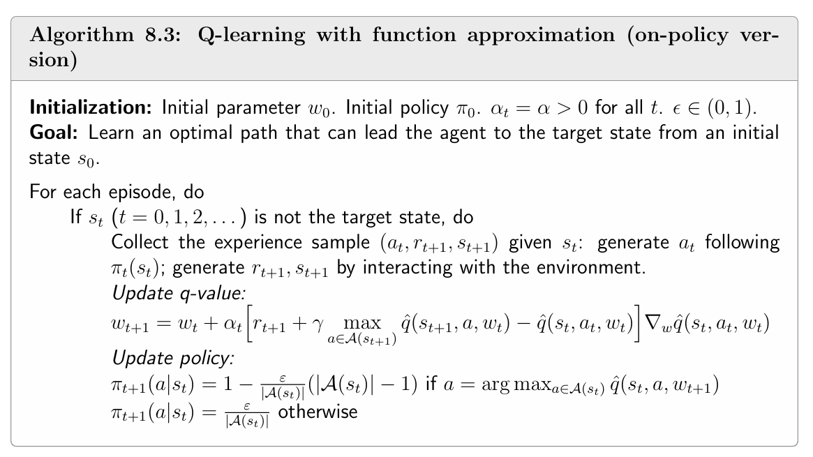
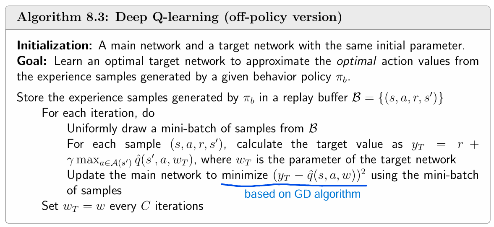

#### Chapter 8 Value Function Approxiamation

TD of state values with function approximation, Sarsa with function approximation, Q-learning with function approximation, Deep Q-learning

**TD of state values with function approximation**

1. What is the improvement of value function methods based on TD learning? What are the advantages and disadvantages?

2. Explain two main function methods for value estimate.

3. How to find optimal *w* so that the function can best approximate vπ(s)?
4. Explain the probability distribution of states in objective function.

5. How to minimize objective function?

**Sarsa with function approximation**

6. Explain the formula of q value update formula.
7. The process of Sarsa with function approximation.

**Q-learning with function approximation**

8. Explain the formula of q value update formula.
9. The process of Q-learning with function approximation.

**Deep Q-learning**

10. What is the differece between Q-learning with function approximation and Deep Q-learning?

11. Explain the experience replay method of DQN.
12. Explain the parameter updating method of DQN.

13. Explain the process of DQN.

1. The state values/action values are represented in function form rather than tabular form. We use a function to fit the values. Thus this will decrease the price of storing but sacrify accuracy. In addition, function method has a better generalization ability because updating a value will cause the change in the param of the function which results in updating some other values.

2. First is linear function approximation. *Φ(s)* is the feature vector, *w* is the parameter vector. We should fix *Φ(s)* and update *w* to fit the values. However, it is difficult to decide the length of *Φ(s)* cause we need a pre-understanding of the task. If is combined with TD for function approximation, it can be called TD-Linear.

​	Second is artificial nerual networks. The input is a state and out put is the estimation of state 	value. Artificial neural networks can approximate values as black-box universal nonlinear 	    	approximators, which are more friendly to use.

3. We define objective funtion and minimize it:

4. As the agent executes a policy for a sufficient long time, the probablity of visiting the states will become stable and this is the stationary distribution dπ(s). This is the long-term behavior of Markov decision process. Thus, *J(w)* can be written as

5. 

6. 

7. 

8. 

9. 

10. DQN uses a special param updating method and experience replay method. What's more, in terms of derivation, qπ(s,a) is approximated by TD spirit before calculating its gradient. It makes it difficult to calculate gradient thus we introduce a special param updating method and experience replay method. The reason why we make this trouble is because DQN is combined with deep networks which has high dimension parameters and will cause unstable learning process.

11. Because it is difficult to calculate the derivative of "max" item in J(w), we denote w in "max" item as wT. Then we have two networks which are called target network wT and main network w. wT and w have the same initial value. We fix the value of wT every C iterations and then update wT ← w.

12. We collect all the experience examples into the replay buffer. For ever iteration, select a mini-batch of examples {(s, a, r, s')} following i.i.d and use them for training. There are two reasons for introducing this method: Firstly, the initial sequence gained from πb has a specific order. If we use this order it may cause over-training of some specific (s,a). Thus it is crucial to break the correlation between samples in the sequence to meet uniform distribution. Secondly, each example may use more than once to increase data efficiency.

13. 

