#### Chapter 9 Policy Gradient Methods

Policy Gradient, Monte Carlo Policy Gradient

**Policy Gradient**

1. What is the idea about Policy Gradient Methods?
2. Explain different forms and distributions of average state value metric and average reward. What is the relationship between these two metrics?

3. Explain the form of derivatives of metrics.

**Monte Carlo Policy Gradient (REINFORCE)**

4. Explain the process of MCPG. Why is it also called REINFORCE?

5. Why Policy Gradient can keep a balance between exploiation and exploration?
6. Explain the process of MCPG.

1. Policy is used to be represented in tabular form. Policy gradient methods represent policy in function form and use scalar metrics to evaluate and update the policy to find optimal policies. Policy gradient methods are policy-based, instead of value-based in the previous chapters. It is more efficient to handle large state/action space and has stronger generalization ability to make it more efficient in data utilization. The basic method is using the gradient-ascent method to optimize the metric J(θ) to find optimal policy: 

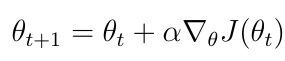

​	where J(θ) is the metric, α is the optimizing rate.

2. 

​	**Average state value:**	

​	The basic form is:

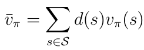

​	Also can be written as:

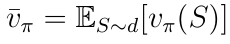

​	Also:

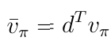

​	Also:

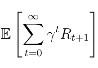

​	where {R} is gained by the agent following policy π(θ) with suffient episodes and length.

​	For the last form, we can prove it is equal to other forms: 

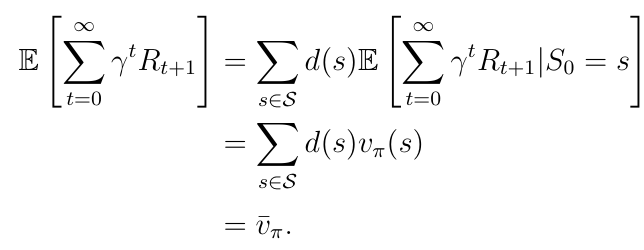

​	Usually use 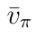 to refer to stationary distribution and use 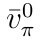 to refer to the case where d(s) is independent of the policy.

​	**Average reward:**

​	basic form:

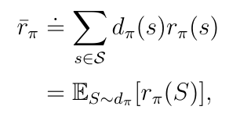

​	where rπ(s) is E[r(s, A)|s] = Σπ(a|s, θ) · r(a,s), where r(a,s) = E[R|s,a] = Σrrp(r|s,a).s

​	Also:

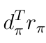

​	Also:

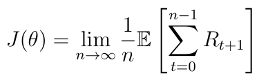

​	**Relationship:**

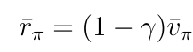

3. 

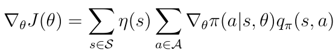

​	Also:

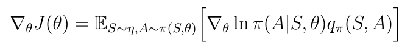

​	To satisfy π(A|S,θ) > 0, we use softmax function:

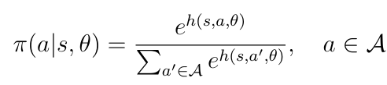

​	which can ensure π(a|s,θ) > 0 and the total is 1. This policy can be realized by neural network.

4. Use gradient-ascent method to maximize J(θ):

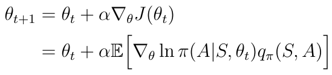

​	we use samples to approximate the expectation. To be noted, qπ(st,at) is unknown and we use qt(st,at) to approximate it. If qt(st,at) is obtained from Monte Carlo Estimation, then the method is called REINFORCE or Monte Carlo Policy Gradient. Transform the derivative in the equation:

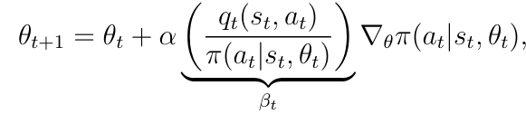

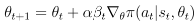

5. Firstly, if β >= 0, the probability of choosing current (st,at) increases. The greater β is, the stronger the increase is.

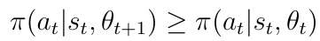

​	Similarly, if β < 0, the probability of choosing current (st,at) decreases.

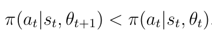

​	Then, if qt is large, then β is large, then the probability increases. This increases the exploitation. Similarly, if πt is small, then β is large when qt > 0, then the probability increases. This increases the exploration.

6. 

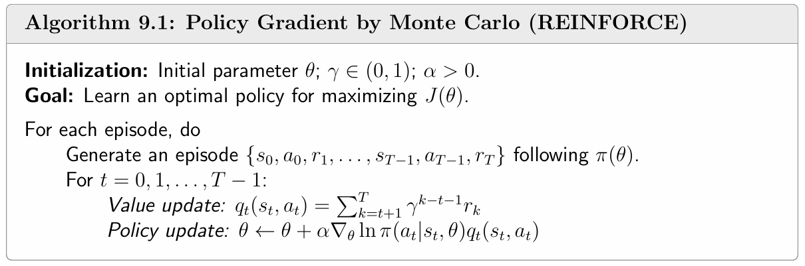
